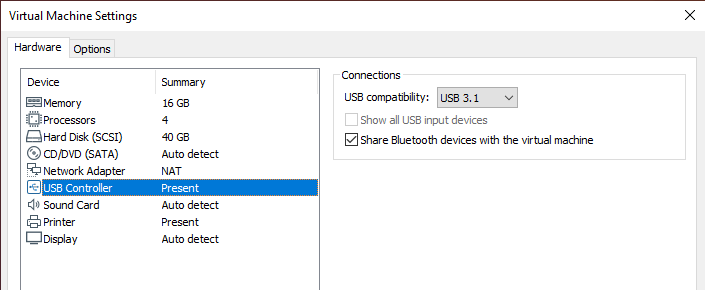
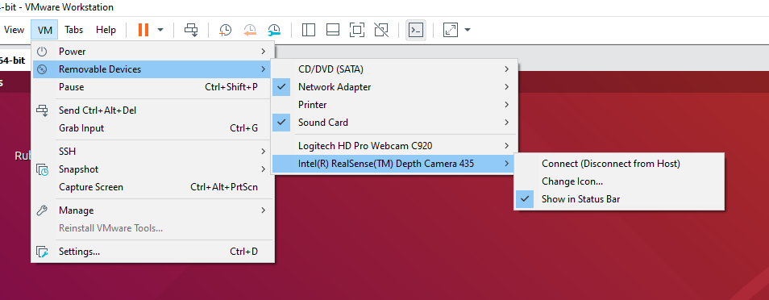

# Setup
This docuemnent contains instructions on how to setup development enviroment for the TBDr ERL codebase. These instructions have been tested in Windows 10 and Ubuntu 18.04.

## Table of Contents
- [Setting up a VM on Windows](#windows)
- [Docker Development Enviroment](#docker)
- [Using VSCode for Development](#vscode)

# <a name="windows"></a>Setting up a Virtual Machine on Windows
The basic instructions are as follows
- Download and install [Oracle VirtualBox](https://www.virtualbox.org/)
- Download the latest Ubuntu 18.04 .iso [here](https://releases.ubuntu.com/18.04/)
- Disable Microsoft Hyper-v if enabled, see below
- Follow instructions for setting up virtual machine, [here](https://brb.nci.nih.gov/seqtools/installUbuntu.html)
- If using realsense cameras setup USB connections as below
- Follow developement enviroment setup, [see below](#docker)
- Do programming

## Disable Hyper-v
Search for `Turn windows features on or off`. In the list of features make sure `Hyper-V -> Hyper-V Platform -> Hyper-V Hypervisors` is deselected. Then restart your computer.

[](images/disable-hyper-v.png)

<!-- ## Connecting USB in VMWare
Make sure USB is set to 3.1. Then once the VM is turned on connect to the USB device throught the `VM -> Removable Devices` menu. See below

[](images/set_usb_vmware.png) [](images/Connect_Realsense_VMWare.png) -->

## Connectiong USB Devices in Virtual Box
Make sure the USB adapter is set to USB 3. Then once the VM is turned on connect to the USB device throught the `Devices -> USB` menu. See below

[](images/set_usb_virtualbox.png) [](images/Connect_Realsense_VirtualBox.png)

`lsusb` can be run to confirm the USB device has been detected

# <a name="docker"></a>Docker Development Enviroment
To setup the developement enviroment the following steps must be performed

Install docker - Follow the instructions listed below
- [Install Docker Engine on Ubuntu](https://docs.docker.com/engine/install/ubuntu/)
- [Post-installation steps for Linux](https://docs.docker.com/engine/install/linux-postinstall/)

Clone the github repository
```bash
$ git clone https://github.com/fsherratt/upgraded-parakeet.git
```
Build the docker container, this may take a while
```bash
$ cd upgraded-parakeet
$ sudo docker build --tag tbd-erl .
```
Launch a docker container. The `--mount` flag can be used to connect host OS directories to the docker container, see more here [_Use bind mounts_](https://docs.docker.com/storage/bind-mounts/). The below commands mounts the upgraded_parakeet directory to `workspaces/upgraded-parakeet` in the docker container.
```bash
$ sudo docker run \
    --name devtest \
    --mount source=[PATH_TO_UPGRADED_PARAKEET],target=/workspaces/upgraded-parakeet,type=bind \
    tbd-erl
```

## Accessing Host USB Devices
To allow a docker container to access host USB device it must be running in an elevated privilieged mode, this can be achieved using the `--privileged` flag.
```bash
$ sudo docker run --privileged ...
``` 

## Displaying Graphics from Docker
Docker is a command line only enviroment so in order to display graphics suitable resource must be presented to it. The following Docker options lines connect the host X11 server to the docker enviroment, _tested on Ubunutu 18.04_. This is useful for visualising results using commands such as `cv2.imshow`.
```bash
$ sudo docker run \
    --env DISPLAY \
    --mount source=/tmp/.X11-unix,target=/tmp/.X11-unix,type=bind \
    ...
```
<!-- --mount source=/dev,target=/dev,type=bind \ -->
The following line must be run in the docker host OS to allos external access to the host X11 service. It must be run in the after each restart
```bash
$ xhost +
access control disabled, clients can connect from any host
```

## Complete Command
```bash
$ sudo docker run \
    --name erl_dev
    --privileged \
    -env DISPLAY \
    --mount source=[PATH_TO_UPGRADED_PARAKEET],target=/workspaces/upgraded-parakeet,type=bind \
    --mount source=/tmp/.X11-unix,target=/tmp/.X11-unix,type=bind \
    tbd-erl
```

To start a stopped container
```bash
sudo docker start erl_dev
```

To connect to a running container, the `-it` flag starts and interative terminal session
```bash
sudo docker exec -it erl_dev \bin\bash
```

To stop a running container
```bash
sudo docker stop erl_dev
```

Additional commands see [_Command-line reference_](https://docs.docker.com/engine/reference/commandline/docker/)

# <a name="vscode"></a>Using VSCode for Development
Microsoft's [VSCode IDE](https://code.visualstudio.com/) features tools for working with containers that give a more familiar programming feel. 

The [_ms-vscode-remote.remote-containers_](https://marketplace.visualstudio.com/items?itemName=ms-vscode-remote.remote-containers) extension allows VSCode to initialise and control Docker containers. Many more details can be found here [VS Code Remote Development](https://code.visualstudio.com/docs/remote/remote-overview)

VSCodes interation with the repository container are defined by the `.devcontainer/devcontainer.json` file. An exaple file for this repository can be found here [devcontainer.json](example\devcontainer.json)

## VSCode settings
IDE settings for the project are set in the `.vscode/settings.json` file. An example settings file for this project can be found here [.vscode/settings.json](example\settings.json).