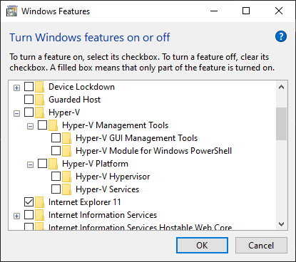
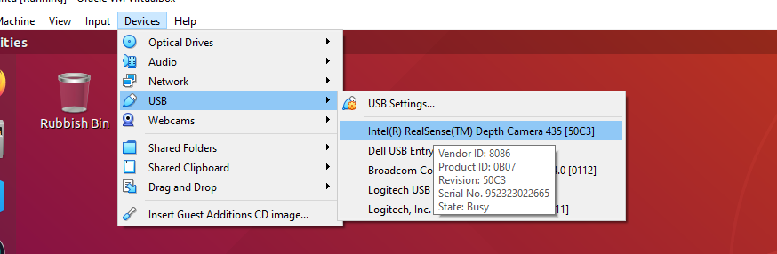

# Development Enviroment Setup
Development is done in a Vagrant virtual machine, this ensures everyone is working in a consistent enviroment. The instructions in this document will help you get set up.

## Table of Contents
- [Useful Links](#useful)
- [FAQs](#faq)
- [Software Installation](#install)
- [USB Devices](#usb)
- [Next Steps](#steps)

## Useful Links
- [Oracle VirtualBox](https://www.virtualbox.org/)
- [Learn Vagrant](https://learn.hashicorp.com/collections/vagrant/getting-started)

# FAQs
### What is a Virtual Machine?
A Virtual Machine (VM) is a computer is created within a computer. The virtual machine is sandboxed from the rest of the system, meaning that the software inside a virtual machine can’t escape or tamper with the host computer. This seperation also means that when you break it you can easily tear it down and spin up a brand new VM. This produces an ideal development environment. [see more — youtube video on virtualisation](https://www.youtube.com/watch?v=XItj08D5KPk)

### What is Vagrant?
Vagrant simplifies the creation of virtual machines by generating them based on a Vagrantfile. By doing this everyone ends up with identical developement enviroments. [See more — vagrantup.com](https://www.vagrantup.com/)

### How do I add new Software to the VM?
The VM acts just like a normal Linux installation so you can add software as normal. However to share any changes to the dev enviroment with other developers the Vagrant setup files will need to be changed. The files to editing are the `Vagrantfile` and `bootstrap.sh` files.

You may be periodically asked to run `vagrant provision` to keep your VM up to date.

# Installation
Follow the instructions below to get setup.

## Host Software
You need to install Virtualbox, Vagrant and Git

- [Oracle VirtualBox](https://www.virtualbox.org/)
- [HashiCorp Vagrant](https://www.vagrantup.com/docs/installation)
- [Git](https://github.com/git-guides/install-git)

On windows you will need to disable hyper-v. Then in the start menu search for `Turn windows features on or off`. In the list make sure `Hyper-V` is deselected as below, if you have to change this restart your computer.

## Virtual Machine Setup
- Open terminal/command prompt/powershell and navigate to a suitable folder for install

    `cd Documents`

- Git clone repository

    `git clone https://github.com/fsherratt/upgraded-parakeet.git`

- Open the downloaded repository

    `cd upgraded-parakeet`

- Before we use vagrant we need to install the vbguest plugin

    `vagrant plugin install vagrant-vbguest`

- Start up the vagrant machine — Go get a coffee this will take a while

    `vagrant up`
    
- When that has finished running reboot the vm 

    `vagrant reload`

- In the virtual machine window click on the vagrant user, a gear icon should appear in the bottom right corner. Click the gear and select `Ubuntu on Wayland`

- Login using the password `vagrant`

- If everything has worked correctly you should now have a full screen virtual machine (you may need to log in and out) — Now go and make something awesome.

For next steps see — [Next Steps](#next)

# Connecting USB Devices in Virtual Box
If using physical realsense cameras, setup USB connections as below

In the setting menu of the VM make sure the USB adapter is set to USB 3. Turn on your VM and once connected you can pass through a USB connecting through the `Devices -> USB` menu. The `lsusb` command can be run to confirm the USB device has been detected in the VM. 

The T265 is a bastard and changes it's enumerationa after connection, it can be useful to run realsense viewer in the host machine before connecting to the VM

<!--  -->

# Next Steps
Now you have a working development enviroment setup you can follow the other documentation to get started with the project.

- For details of simulation enviroments see [...](#)

